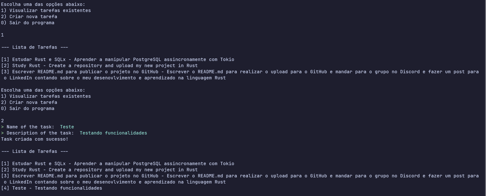

<div align="center">
    
</div>
<h2 align="center">Reminder List CLI</h2>

<div align="center">
    
    
    
</div>

<div align="center">
    <!-- Stars -->
    <a href="https://github.com/Xoppee931/Rust-Basics/stargazers">
        
    </a>
    <!-- Forks -->
    <a href="https://github.com/Xoppee931/Reminder-List/network/members">
        
    </a>
    <!-- Open Issues -->
    <a href="https://github.com/Xoppee931/Reminder-List/issues">
        
    </a>
    <!-- Last Commit -->
    
</div>

# Features

- **Create Tasks**: Easily add new tasks with mandatory titles and descriptions.
- **View Tasks**: Display all stored tasks reminders in an organized list format.
- **Interactive CLI**: Built using `inquire` for intuitive prompt inputs and smooth menu navigation.
- **Persistent Storage**: Uses PostgreSQL via `sqlx` for async database queries


# Tech Stack

- **Language**: Rust
- **Async Runtime**: Tokio
- **Database**: PostgreSQL
- **SQL Driver**: `sqlx` (Async SQL)
- **CLI Prompts**: `inquire`

# Prerequisites

Before running this project, ensure you have the following installed:

* [Rust & Cargo](https://www.rust-lang.org/tools/install) (latest stable version)
* [Docker Desktop / Engine](https://docs.docker.com/get-docker/)

# Examples

## 1. Clone the repository
```bash
git clone https://github.com/Xoppee931/Rust-Basics.git
cd Rust-Basics/reminder-list
```

## 2. Set up database with Docker
```bash
docker compose up -d --build
```

## 3. Start the program
```bash
cargo run
```

# Preview

<div align="center">
    
    <p>This is how the program works</p>
</div>

# Documentation

- [**Docker Documentation**](https://docs.docker.com/)
- [**Rust Documentation**](https://doc.rust-lang.org/stable/)

# License

This project is licensed under the MIT License - see the [LICENSE](LICENSE) file for details.
